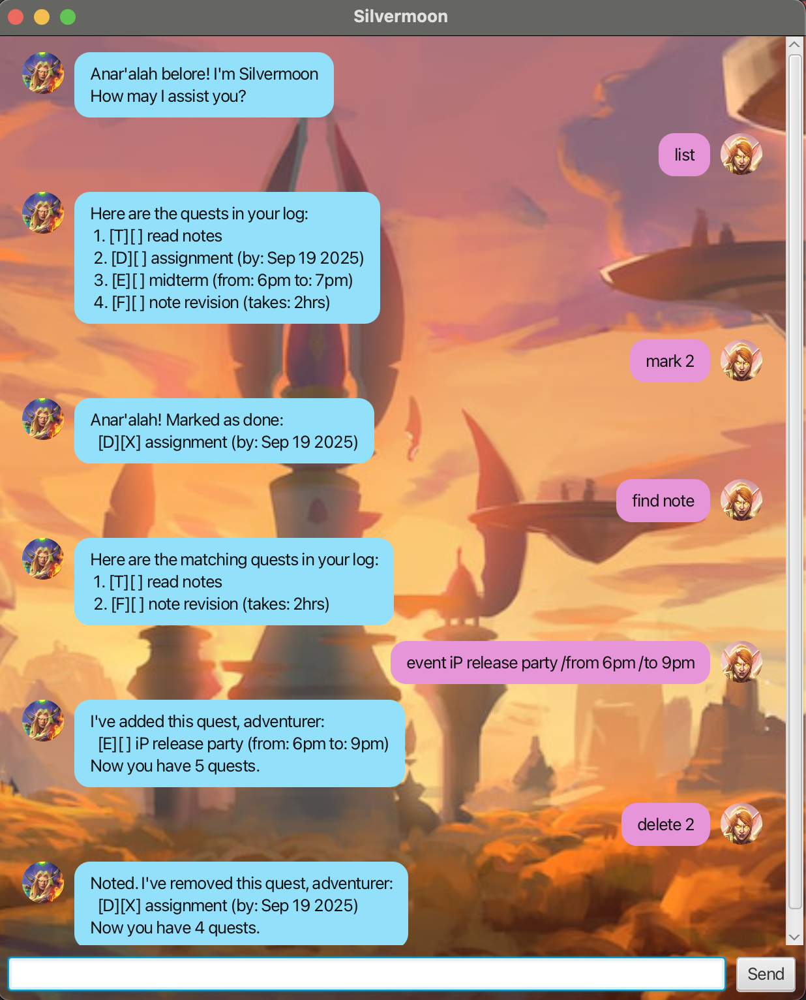

# Silvermoon User Guide

## Introduction
Silvermoon is a lightweight task assistant. Add todos, deadlines (with real dates), events, or tasks with fixed durations; list, mark, unmark, delete, and search — all via a clean JavaFX chat-style UI. Data is auto-saved to `./data/silvermoon.txt` in the folder where you run the app.

---

## Features

### Add a ToDo
**Format:**
todo <description>

**Example:**
todo read book

**Expected:**

I've added this quest, adventurer:

[T][ ] read book

Now you have 2 quests.

### Add a Deadline
**Format:**
deadline <description> /by yyyy-MM-dd

**Example:**
deadline return book /by 2019-12-02

**Expected:**

I've added this quest, adventurer:

[D][ ] return book (by: Dec 2 2019)

Now you have 3 quests.

### Add an Event
**Format:**
event <description> /from <start> /to <end>

**Example:**
event project meeting /from Mon 2pm /to 4pm

**Expected:**

I've added this quest, adventurer:

[E][ ] project meeting (from: Mon 2pm to: 4pm)

Now you have 4 quests.

### Add a FixedDuration task
**Format:**
fixed <description> /for <duration>

**Example:**
fixed holiday /for 24hrs

**Expected:**

I've added this quest, adventurer:

[F][ ] holiday (takes: 24hrs)

Now you have 5 quests.

### List tasks
**Format:**
list

**Expected:**

Here are the quests in your log:

[T][ ] read book

[D][ ] return book (by: Dec 2 2019)

[E][ ] project meeting (from: Mon 2pm to: 4pm)

### Mark a task as done
**Format:**
mark <taskNumber>

**Example:**
mark 2

**Expected:**

Anar'alah! Marked as done:

[D][X] return book (by: Dec 2 2019)

### Unmark a task
**Format:**
unmark <taskNumber>

**Example:**
unmark 2

**Expected:**

OK, marked as not done:

[D][ ] return book (by: Dec 2 2019)

### Delete a task
**Format:**
delete <taskNumber>

**Example:**
delete 3

**Expected:**

Noted. I've removed this quest, adventurer:

[E][ ] project meeting (from: Mon 2pm to: 4pm)

Now you have 4 quests.

### Find tasks by keyword
**Format:**
find <keyword>

**Example:**
find book

**Expected:**

Here are the matching quests in your log:

[T][ ] read book

[D][ ] return book (by: Dec 2 2019)

### Exit
**Format:**
bye

**Expected:**
Band'or shorel'aran, farewell champion.
